# Cybercore Opportunity Intelligence Pipeline in Foundry

**Author:** Manus AI
**Contract version:** 1.0.0
**Foundry manifest:** [`manifests/cybercore-opportunity-intelligence.json`](../../manifests/cybercore-opportunity-intelligence.json)

## Purpose and ownership

The **Cybercore Opportunity Intelligence Pipeline** converts normalized opportunity records into evidence-bound, strategically scored, commercially routed, and maturity-classified decision-support artifacts. Foundry owns the executable plugin composition and durable output engine. The `sovereign-os` repository remains the source of the Cybercore domain contract, event semantics, and human-authorization boundary.[1]

> **Ownership rule:** Cybercore defines what an opportunity record means. Foundry defines how that record is processed through pure plugins and materialized as immutable operator artifacts.

This placement avoids a second standalone runtime. It uses Foundry’s existing universal opportunity domain, deterministic plugin pattern, controlled artifact materialization, durable execution lifecycle, and approval-gated external-action boundary.[2] [3]

| Concern | Canonical owner | Foundry implementation |
|---|---|---|
| Opportunity identity and provenance | Foundry universal opportunity domain | `agent/opportunities/domain.py` |
| Cybercore verification and intelligence semantics | `sovereign-os` Cybercore contract | `agent/opportunities/intelligence/` |
| Pure stage plugins | Foundry | `agent/opportunities/intelligence/plugins.py` |
| Deterministic plugin registry | Foundry | `agent/opportunities/intelligence/registry.py` |
| Pipeline orchestration | Foundry | `agent/opportunities/intelligence/pipeline.py` |
| Immutable output materialization | Foundry | `agent/opportunities/integration.py` |
| Human approval and execution | Foundry execution lifecycle | `agent/opportunities/execution.py` and runtime plugins |
| Cross-repository input | `sovereign-os` batch and evidence | `agent/opportunities/intelligence/cybercore.py` |

## End-to-end flow

```mermaid
flowchart LR
    A[Cybercore batch] --> B[Cybercore evidence adapter]
    B --> C[Universal Opportunity]
    C --> D[Source Verification Plugin]
    D --> E[Strategic Intelligence Plugin]
    E --> F[Commercialization Routing Plugin]
    F --> G[Maturity Output Plugin]
    G --> H[Foundry v2 Artifact Sink]
    H --> I[Human Review Queue]
    I -. explicit approval only .-> J[Execution Runtime]
```



The pipeline is **pre-execution decision support**. It cannot submit, contact, purchase, register, bid, upload, commit funds, sign a contract, or hand an opportunity to Treasury Labs. Only a maturity output marked `HUMAN_REVIEW` may initialize a Foundry execution context, and even that context remains subject to the execution engine’s explicit approval rules.[3] [4]

## Native plugin contract

Every plugin receives an immutable `OpportunityIntelligenceContext` and returns information only. The registry requires exactly one plugin for each stage, enforces contiguous order `1..4`, rejects duplicate identifiers and stages, and fails closed when the chain is incomplete.

| Order | Plugin | Input requirement | Output |
|---:|---|---|---|
| 1 | `cybercore-source-verification` | Canonical opportunity, evidence packet, provenance | Strict verification state and temporal classification |
| 2 | `cybercore-strategic-intelligence` | Strictly verified record | Explainable five-dimension policy score or `null` |
| 3 | `cybercore-commercialization-routing` | Verification, temporal state, score | Candidate commercial paths and human-review readiness |
| 4 | `cybercore-maturity-output` | Commercialization decision | Final maturity stage and disposition |

Each stage output is canonicalized and SHA-256 hashed. The final output contains a four-entry plugin trace and its own artifact hash. Plugins do not receive the event store, orchestrator, credentials, transport clients, or filesystem authority.

## Source verification

Strict verification requires an issuer, stable opportunity identifier, deadline, and at least one authoritative HTTPS source. A Cybercore evidence item with explicit `issuer_verified`, `identifier_verified`, or `deadline_verified` flags must set each flag truthfully; populated scalar values cannot override a negative evidence decision.

| Verification result | Meaning | Downstream behavior |
|---|---|---|
| `VERIFIED` | All strict fields and authoritative source evidence are present | Eligible for deterministic scoring |
| `NEEDS_SOURCE_VERIFICATION` | One or more strict fields or the authoritative source are missing | Scoring is blocked and maturity remains discovery-oriented |

Temporal classification is derived from the recorded status, classification, deadline, and evaluation date. The available states are `OPEN`, `DEADLINE_TODAY`, `CLOSED`, `FORECAST`, `PROGRAM_ONLY`, and `UNKNOWN`.

## Strategic intelligence scoring

The scoring policy is bundled at [`intelligence-policy-v1.json`](../../agent/opportunities/intelligence/policies/intelligence-policy-v1.json) and is a byte-for-byte port of the validated Cybercore policy.[5] It is an explainable heuristic, **not a statistically calibrated probability model**.

| Dimension | Weight | Interpretation |
|---|---:|---|
| Sector fit | 0.25 | Match against the configured AEGENTIX sector taxonomy |
| Revenue probability heuristic | 0.20 | Opportunity-type baseline plus procurement and temporal adjustments |
| Funding probability heuristic | 0.20 | Funding baseline plus procurement and temporal adjustments |
| Implementation feasibility | 0.15 | Inverse of implementation complexity |
| Strategic alignment | 0.20 | Declared strategic tier and priority signal |

The deterministic formula is:

```text
score = sector_fit × 0.25
      + revenue_probability × 0.20
      + funding_probability × 0.20
      + (100 − implementation_complexity) × 0.15
      + strategic_alignment × 0.20
```

A score of at least `80` recommends `P0`, a score of at least `65` recommends `P1`, and all lower scores recommend `P2`. Closed and forecast records may be scored for intelligence history, but routing still blocks action.

## Commercialization routing

The routing policy is bundled at [`commercialization-policy-v1.json`](../../agent/opportunities/intelligence/policies/commercialization-policy-v1.json). It derives candidate paths from opportunity type, procurement type, market-entry signal, and configured keywords. The path order is deterministic.[6]

| Route status | Maturity stage | Execution context |
|---|---|---|
| `READY_FOR_HUMAN_REVIEW` | `HUMAN_REVIEW` | May be initialized; external action remains approval-gated |
| `CLOSED_NO_ACTION` | `CLOSED` | Not created |
| `MONITOR_FORECAST` | `FORECAST_MONITOR` | Not created |
| `PROGRAM_DISCOVERY_ONLY` | `PROGRAM_DISCOVERY` | Not created |
| `SOURCE_VERIFICATION_REQUIRED` | `SOURCE_DISCOVERY` | Not created |
| `NO_ROUTE_IDENTIFIED` | `STRATEGIC_INTELLIGENCE` | Not created |

A `READY_FOR_HUMAN_REVIEW` decision records Treasury Labs status as `HUMAN_APPROVAL_REQUIRED`. Every other decision records `BLOCKED`. Both paths always set `automatic_dispatch=false` and `handoff_executed=false`.

## Opportunity Maturity Model

The maturity model expresses the farthest safe point reached by a record. It is not a command queue.

| Order | Stage | Disposition | Human decision required |
|---:|---|---|---|
| 20 | `SOURCE_DISCOVERY` | Acquire authoritative evidence | No |
| 40 | `STRATEGIC_INTELLIGENCE` | Review route gap | No |
| 45 | `FORECAST_MONITOR` | Monitor for release | No |
| 45 | `PROGRAM_DISCOVERY` | Discover a specific child opportunity | No |
| 50 | `HUMAN_REVIEW` | Decide whether to enter execution | **Yes** |
| 90 | `CLOSED` | Preserve as historical intelligence | No |

> **Critical distinction:** `HUMAN_REVIEW` means “ready for an operator decision.” It does not mean “authorized to act.”

## Output engine

Foundry’s `JsonDirectoryArtifactSink` is the canonical output engine. Each run is immutable and receives separate directories for opportunities, evidence packets, mission candidates, mission graphs, intelligence outputs, and complete bundles.

```text
<output-root>/<UTC-run-id>/
├── opportunities/
├── evidence/
├── missions/
├── graphs/
├── intelligence/
├── bundles/
├── manifest.json
└── run.json
```

Every serialized file receives a SHA-256 entry in the run manifest. Intelligence entries additionally expose the intelligence artifact hash, maturity stage, disposition, and human-decision flag. The top-level manifest records intelligence, execution, and human-review counts plus three invariant zero counters:

```json
{
  "automatic_dispatches": 0,
  "external_actions_executed": 0,
  "treasury_labs_handoffs_executed": 0
}
```

The machine-readable contracts are [`opportunity-intelligence-output-v1.schema.json`](../../schemas/cybercore/opportunity-intelligence-output-v1.schema.json) and [`opportunity-run-manifest-v2.schema.json`](../../schemas/cybercore/opportunity-run-manifest-v2.schema.json).

## Operator command

Install the repository and run the committed interoperability fixture:

```bash
python -m pip install .

foundry-cybercore \
  --batch examples/cybercore/2026-08-06/AEGENTIX-CYBERCORE-OPP-INTAKE-2026-08-06.json \
  --evidence examples/cybercore/2026-08-06/source-verification-2026-08-06.json \
  --output-root var/opportunities/cybercore-runs \
  --evaluated-at 2026-08-06T17:32:17Z
```

The command prints only an aggregate decision-support summary. Complete records remain in the immutable run directory.

## Acceptance profile for the committed 22-record fixture

The versioned fixture demonstrates every major maturity branch and preserves the prior validated outcome distribution.

| Outcome | Count |
|---|---:|
| Strictly verified | 13 |
| Retained for source verification | 9 |
| Ready for human review | 5 |
| Closed | 7 |
| Program discovery | 6 |
| Forecast monitor | 1 |
| Source discovery | 3 |
| Execution contexts initialized | 5 |
| Automatic dispatches | **0** |
| External actions | **0** |
| Treasury Labs handoffs | **0** |

## Cross-repository binding

The Foundry manifest pins the source Cybercore contract to sovereign-os commit `f92a284f6c12fbc78bf472cc6007995ea9584e31`. The committed example batch, evidence file, scoring policy, and commercialization policy each carry SHA-256 values in the manifest. A change to those bytes must therefore produce a deliberate manifest update.

The prior `sovereign-os/FOUNDRY` layer remains a Sovereign OS integration adapter. This repository is the canonical implementation of the Foundry runtime, plugin chain, and output engine. Complete acceptance evidence is published in [`VERIFICATION.md`](VERIFICATION.md).[7]

## References

[1]: https://github.com/shalominattii-us/sovereign-os/blob/f92a284f6c12fbc78bf472cc6007995ea9584e31/CYBERCORE/opportunity_intake/docs/INTELLIGENCE_PIPELINE_SPEC_v2.md "Cybercore Intelligence Pipeline Specification v2"
[2]: https://github.com/shalominattii-us/Foundry/blob/v1.0.0-rc1/docs/universal-execution-engine-rc1.md "Foundry Universal Execution Engine RC1"
[3]: https://github.com/shalominattii-us/Foundry/blob/v1.0.0-rc1/docs/adr/0004-sacred-execution-boundary.md "Sacred Execution Boundary"
[4]: https://github.com/shalominattii-us/sovereign-os/blob/f92a284f6c12fbc78bf472cc6007995ea9584e31/CYBERCORE/opportunity_intake/src/authorization.js "Cybercore Human Authorization Contract"
[5]: https://github.com/shalominattii-us/sovereign-os/blob/f92a284f6c12fbc78bf472cc6007995ea9584e31/CYBERCORE/opportunity_intake/policy/intelligence-policy-v1.json "Cybercore Strategic Intelligence Policy v1"
[6]: https://github.com/shalominattii-us/sovereign-os/blob/f92a284f6c12fbc78bf472cc6007995ea9584e31/CYBERCORE/opportunity_intake/policy/commercialization-policy-v1.json "Cybercore Commercialization Policy v1"
[7]: VERIFICATION.md "Foundry Cybercore Opportunity Intelligence Verification"
